# OCUDU O1 Adapter

The **OCUDU O1 Adapter** is a Python-based management adapter that provides an O1 management interface between the **OCUDU CU/DU** and the **Service Management and Orchestration (SMO)** platform.

The adapter currently provides:

* **Configuration Management (CM)** through NETCONF/YANG
* **Fault Management (FM)** through VES notifications
* **Performance Management (PM)** using OCUDU's WebSocket metrics service and the O-RAN-SC RANPM file-based ingestion pipeline
* **O-RU management** through NETCONF/M-Plane
* **Configuration health monitoring** through a REST API

In a Kubernetes deployment, the O1 Adapter is intended to run as a **sidecar container** alongside the OCUDU CU/DU container. It manages configuration generation/provisioning, management connectivity, PM file generation, and configuration health through shared storage and REST-based interfaces.

---

# 1. Features

## 1.1 Configuration Management (CM)

The O1 Adapter connects to a NETCONF server and retrieves the `running` datastore.

The retrieved configuration is rendered using a selected OCUDU configuration profile and used to generate the corresponding CU/DU configuration.

Supported component profiles include:

* `gnb`
* `cu`
* `cucp`
* `cuup`
* `du`
* `ru`

The default profile is `gnb`.

A custom rendering template can also be supplied explicitly.

---

## 1.2 Fault Management (FM)

The adapter provides VES-based fault management capabilities for communicating fault-related information toward the SMO.

VES is also used by the PM implementation to send `fileReady` notifications when a new PM measurement file is available.

---

## 1.3 Performance Management (PM)

OCUDU provides performance metrics through its native JSON-based WebSocket metrics service.

The O1 Adapter consumes these metrics and converts them into a standardized file-based PM representation for ingestion by the SMO RANPM pipeline.

The implemented PM flow is:

```text
OCUDU WebSocket Metrics
          │
          ▼
   O1 Adapter PM Reporter
          │
          ▼
   3GPP PM XML File
          │
          ├──────────────► VES fileReady
          │                       │
          │                       ▼
          │                 VES Collector
          │                       │
          │                       ▼
          │                     Kafka
          │                       │
          │                       ▼
          │               DataFileCollector
          │                       │
          │              HTTP GET │
          │                       ▼
          └──────────────► O1 Adapter
                          PM File Server
                              :5000
                                  │
                                  ▼
                                MinIO
                                  │
                                  ▼
                            RANPM Processing
                                  │
                                  ▼
                                pmlog
                                  │
                                  ▼
                              InfluxDB
                         ran-pm-metrics
```

The implementation retains OCUDU's native WebSocket metrics source and adds the standardized file-based SMO ingestion path. 

The PM reporter aggregates WebSocket metrics over a configurable granularity period and generates a 3GPP `measData` XML file. 

---

## 1.4 O-RU Management

The repository provides a standalone RU controller for configuring an O-RU over the O-RAN Management Plane (M-Plane).

The RU controller communicates with the RU using NETCONF.

The O1 Adapter can also optionally forward configuration updates from a DU NETCONF server to an RU NETCONF server.

---

## 1.5 Configuration Health Monitoring

The adapter exposes a REST API that reports whether the generated configuration is healthy.

A configuration change in the NETCONF `running` datastore can cause the adapter to report the configuration as unhealthy.

This state can be used by a Kubernetes deployment to trigger a DU restart.

---

# 2. Architecture

The O1 Adapter provides several management paths between the OCUDU CU/DU, O-RU, and SMO.

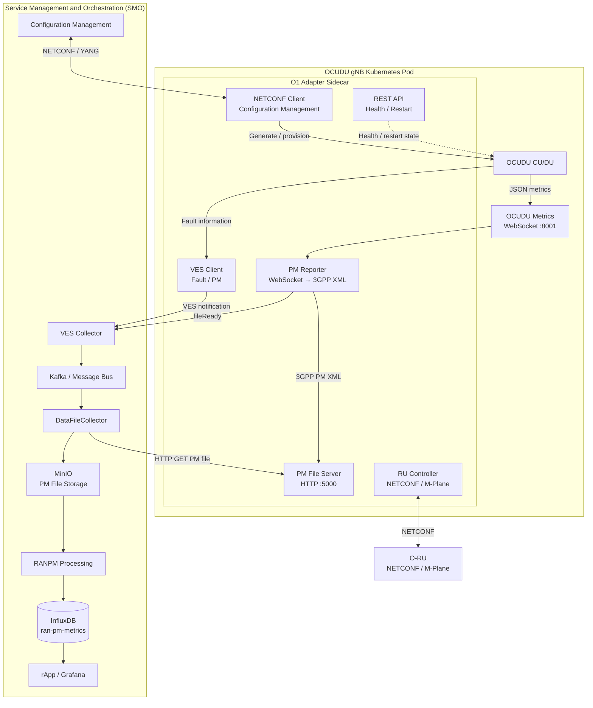

---

# 3. Component Architecture

The main logical components of the O1 Adapter are:

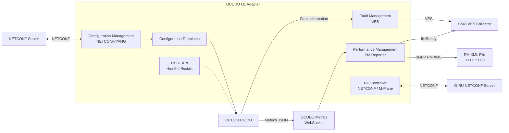

---

# 4. Interfaces

| Function          | Interface              | O1 Adapter Role                                              | Destination             |
| ----------------- | ---------------------- | ------------------------------------------------------------ | ----------------------- |
| **CM**            | NETCONF/YANG           | Retrieve, process, and render configuration                  | OCUDU CU/DU             |
| **FM**            | VES                    | Generate/send fault notifications                            | SMO VES Collector       |
| **PM**            | WebSocket + VES + HTTP | Aggregate metrics, generate PM XML, announce and serve files | SMO RANPM / InfluxDB    |
| **RU Management** | NETCONF/M-Plane        | Retrieve/configure/forward RU configuration                  | O-RU                    |
| **Health**        | REST                   | Report configuration health and restart state                | Kubernetes / automation |

---

# 5. Installation

## 5.1 Ubuntu Packages

Install the required Python packages:

```bash
sudo apt-get install \
    python3-ncclient \
    python3-flask \
    python3-xmltodict \
    python3-websockets \
    python3-deepdiff
```

Alternatively, install the Python dependencies using `requirements.txt`:

```bash
python3 -m venv .venv
source .venv/bin/activate

pip install -r requirements.txt
```

---

# 6. Operation

## 6.1 Start the O1 Adapter

Make sure a NETCONF server is running and reachable.

The default NETCONF endpoint is:

```text
Host: localhost
Port: 830
```

Start the application:

```bash
python3 src/o1_adapter.py
```

At startup, the application attempts to connect to the configuration datastore over SSH/NETCONF.

If the connection succeeds, the adapter retrieves the `running` datastore and generates the initial configuration file.

---

# 7. Configuration Profiles

The adapter provides templates for the following split components:

```text
gnb
cu
cucp
cuup
du
```

The default profile is:

```text
gnb
```

Select a profile using:

```bash
python3 src/o1_adapter.py --profile cucp
```

The adapter loads:

```text
<profile>.yaml
```

For example:

```bash
python3 src/o1_adapter.py --profile du
```

uses:

```text
du.yaml
```

A custom template can be provided using:

```bash
python3 src/o1_adapter.py --template <file>
```

---

## 7.1 RU Profile

The special `ru` profile skips YAML rendering and forwards the raw NETCONF configuration downstream.

```bash
python3 src/o1_adapter.py --profile ru
```

---

# 8. Configuration Health

The adapter exposes a REST endpoint for checking configuration health.

Check the current status:

```bash
curl -i http://localhost:5000/config-healthy
```

A valid configuration should report the configuration as healthy.

After a configuration modification is made to the NETCONF `running` datastore, the adapter reports the configuration as unhealthy.

This status can be used to trigger a restart of the DU application.

---

## 8.1 Reset Configuration Health

After the DU has been restarted and the configuration has been successfully applied, reset the health state:

```bash
curl \
  -H 'Content-Type: application/json' \
  -d '{ "restarted": true }' \
  -X POST \
  http://localhost:5000/restarted
```

---

# 9. Data Flows

## 9.1 Configuration Management — CM

The CM flow retrieves the NETCONF `running` datastore, selects the appropriate profile/template, and generates the OCUDU configuration.

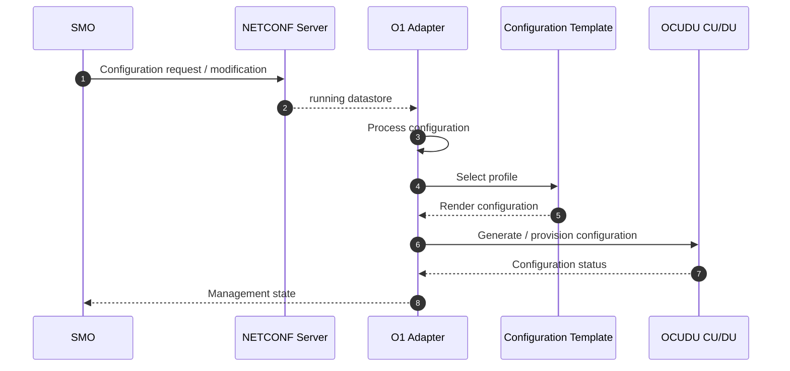

---

## 9.2 Configuration Health Flow

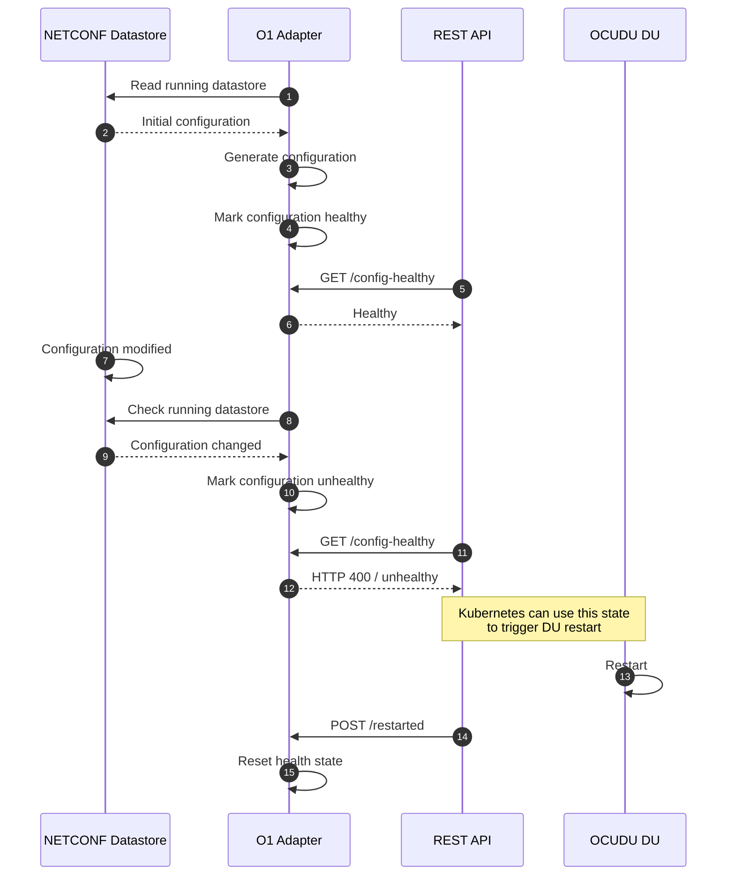

---

# 10. Fault Management — FM

Fault information is communicated from the OCUDU side toward the SMO through VES.

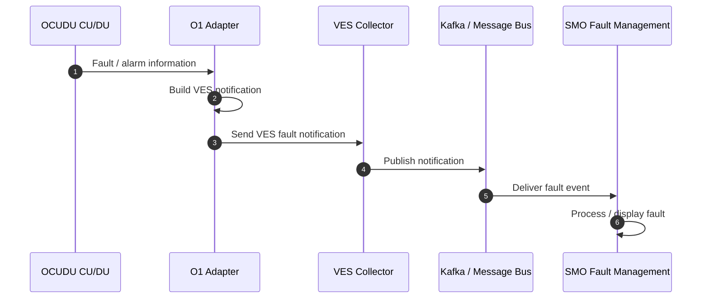

---

# 11. Performance Management — PM

The PM implementation uses OCUDU's native WebSocket metrics service as its source.

The O1 Adapter:

1. Receives JSON metrics from the WebSocket.
2. Aggregates metrics over the configured granularity period.
3. Generates a 3GPP PM `measData` XML file.
4. Sends a VES `fileReady` notification.
5. Serves the generated PM file through HTTP.
6. Allows the SMO DataFileCollector to retrieve the file.
7. Stores and processes the file through the SMO RANPM pipeline.
8. Delivers the resulting measurements to InfluxDB.

The implementation uses the standardized 3GPP PM XML structure, including measurement types, measurement values, measurement objects, timestamps, and granularity information. 

---

## 11.1 PM Message Sequence

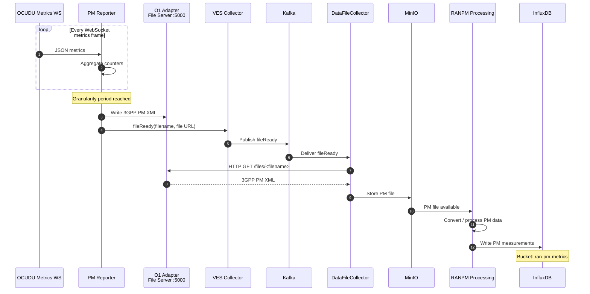

---

## 11.2 PM Data and Notification Paths

The PM architecture uses two complementary paths.

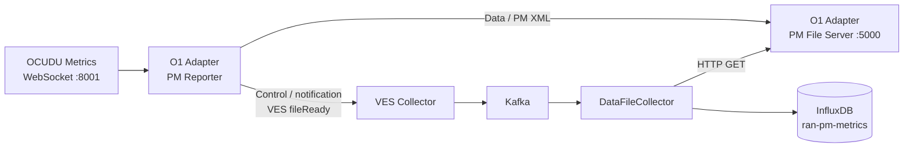

The two paths have different responsibilities:

* **VES `fileReady`** announces that a PM file is available.
* **HTTP :5000** provides the actual PM XML payload.
* **DataFileCollector** receives the notification and retrieves the file.
* The retrieved file continues through the SMO RANPM processing pipeline.

This separation is a key part of the implemented PM architecture. 

---

# 12. PM End-to-End Architecture

The complete implemented PM path is shown below.

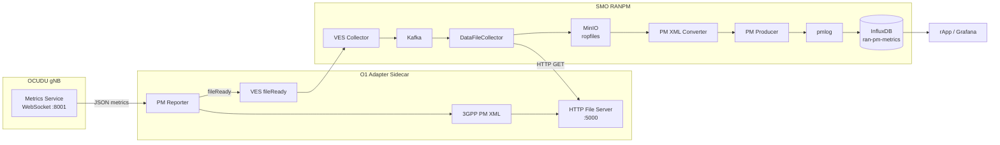

The resulting PM measurements are stored in the SMO InfluxDB bucket:

```text
ran-pm-metrics
```

Example PM fields include:

```text
DRB.PdcpSduVolumeDL
DRB.PdcpSduVolumeUL
DRB.PdcpSduDelayDl
RRC.ConnMean
GranularityPeriod
```

The resource FDN is used as the measurement identity and the PM counter name is represented as the corresponding field. 

---

# 13. PM File Server

The O1 Adapter exposes generated PM files through its HTTP file server.

Default port:

```text
5000
```

Files are available through:

```text
/files/<filename>
```

For example:

```text
http://<OAM-IP>:5000/files/<filename>.xml
```

The Kubernetes O1 service must expose both the NETCONF and PM file-server ports:

```text
830   NETCONF
5000  PM file server
```

The DataFileCollector uses the PM file-server endpoint to retrieve generated measurement files. 

---

# 14. PM Deployment Verification

After deploying the O1 Adapter and Helm chart, verify that the O1 service exposes both ports:

```bash
kubectl -n <namespace> get svc <o1-service> \
  -o jsonpath='{.spec.ports[*].port}'; echo
```

Expected:

```text
830 5000
```

Check that PM files are being generated:

```bash
kubectl -n <namespace> exec <pod> \
  -c <o1-adapter-container> \
  -- sh -c 'ls -t /tmp/A*_OCUDU.xml | head'
```

Check the SMO DataFileCollector:

```bash
kubectl -n <smo-namespace> logs -f <dfc-pod> \
  -c dfc | grep -iE "collectFile|Stored file|refused"
```

Check the PM files in MinIO:

```bash
kubectl -n <smo-namespace> exec <minio-pod> \
  -c minio -- mc ls local/ropfiles
```

Finally, verify the measurements in InfluxDB.

Example Flux query:

```flux
from(bucket: "ran-pm-metrics")
  |> range(start: -30m)
  |> filter(fn: (r) => r._measurement =~ /NRCellDU=nrcelldu1/)
  |> last()
```

---

# 15. RU Controller

The RU controller is a standalone application for configuring an O-RU over M-Plane.

## 15.1 Retrieve RU Configuration

For an RU exposing NETCONF on `10.10.0.100`:

```bash
./ru_controller.py \
  --host=10.10.0.100 \
  -u admin \
  -p admin \
  -d running \
  --get_config
```

---

## 15.2 Activate RU Carrier

```bash
./ru_controller.py \
  --host=10.10.0.100 \
  -u admin \
  -p admin \
  -d running \
  --tx_gain=26.0 \
  --activate_carriers \
  --carrier_state ACTIVE
```

---

## 15.3 Full RU Configuration

```bash
./ru_controller.py \
  --host=10.10.0.100 \
  -u admin \
  -p admin \
  -d running \
  --set_full_config \
  --ru_mac_addr=00:a0:0a:01:a4:42 \
  --vlan=127 \
  --du_mac_addr=9c:69:b4:66:cd:48 \
  --iq_bitwidth=9 \
  --compression_type=STATIC \
  --rf_bandwidth_hz=100000000 \
  --dl_arfcn=649980 \
  --dl_freq=3749700000 \
  --tx_gain=39 \
  --ul_arfcn=649980 \
  --ul_freq=3749700000 \
  --carrier_state ACTIVE
```

Full configuration has been verified for a subset of configurations, including TDD 100 MHz and PRACH format B4.

---

# 16. RU Forwarding

With `--ru_forward`, the O1 Adapter can forward configuration updates from the DU NETCONF server to the RU NETCONF server.

Two NETCONF endpoints must be reachable:

```text
DU NETCONF Server
        │
        │ NETCONF
        ▼
   O1 Adapter
        │
        │ NETCONF forwarding
        ▼
RU NETCONF Server
```

Example:

```bash
python3 src/o1_adapter.py \
  --netconf_host <DU-IP-ADDRESS> \
  --netconf_username <DU-NETCONF-USERNAME> \
  --netconf_password <DU-NETCONF-PASSWORD> \
  --ru_forward \
  --ru_netconf_host <RU-IP-ADDRESS> \
  --ru_netconf_username <RU-NETCONF-USERNAME> \
  --ru_netconf_password <RU-NETCONF-PASSWORD>
```

---

## 16.1 RU Forwarding Message Sequence

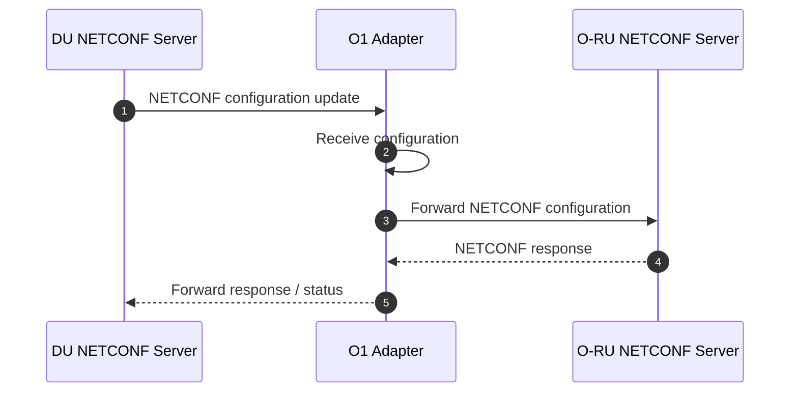

---

# 17. Kubernetes Deployment

In Kubernetes, the O1 Adapter is intended to run as a sidecar container alongside the OCUDU CU/DU.

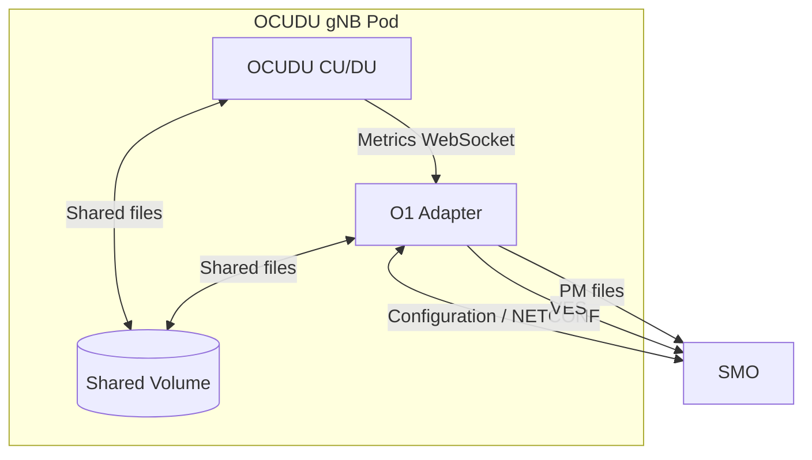

The sidecar architecture allows the adapter to independently handle management functions while remaining colocated with the CU/DU application.

---

# 18. End-to-End Management Architecture

The complete management architecture can be summarized as:

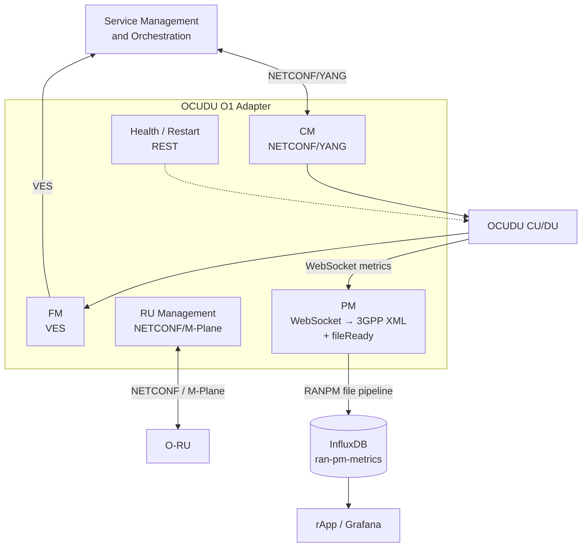

---

# 19. Repository Structure

A typical repository structure is:

```text
.
├── src/
│   ├── o1_adapter.py
│   ├── ves.py
│   ├── pm_reporter_filetype.py
│   └── ...
│
├── templates/
│   ├── gnb.yaml
│   ├── cu.yaml
│   ├── cucp.yaml
│   ├── cuup.yaml
│   ├── du.yaml
│   └── ves/
│       └── file_ready.json
│
├── charts/
│   └── ocudu-gnb/
│       └── templates/
│           └── service-o1.yaml
│
├── requirements.txt
├── README.md
└── LICENSE
```

---

# 20. Management Interface Summary

| Area                         | Source                    | Adapter Function                                | Output               |
| ---------------------------- | ------------------------- | ----------------------------------------------- | -------------------- |
| **Configuration Management** | NETCONF/YANG              | Retrieve and render configuration               | OCUDU CU/DU          |
| **Fault Management**         | OCUDU / fault information | Generate VES notifications                      | SMO VES Collector    |
| **Performance Management**   | OCUDU WebSocket           | Aggregate metrics and generate 3GPP PM XML      | SMO RANPM / InfluxDB |
| **RU Management**            | O-RU NETCONF              | Configure / retrieve / forward RU configuration | O-RU                 |
| **Health Management**        | NETCONF state             | Detect configuration changes                    | REST / Kubernetes    |

---

# 21. PM Measurement Pipeline Summary

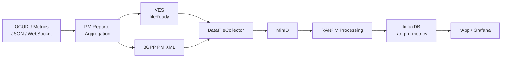

The PM implementation therefore provides a standardized, persistent, and FDN-keyed path from OCUDU performance counters to the SMO time-series database. 

---

# 22. License

This project is licensed under the **BSD 3-Clause Open MPI variant License**.

See [LICENSE](./LICENSE) for details.
